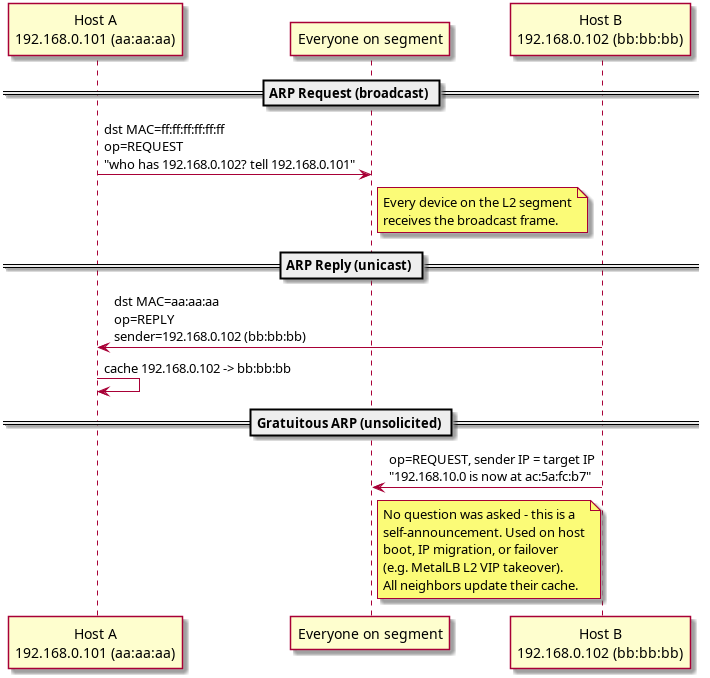
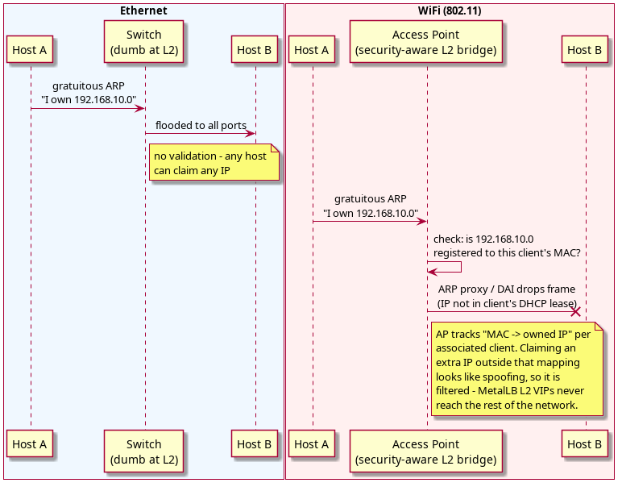
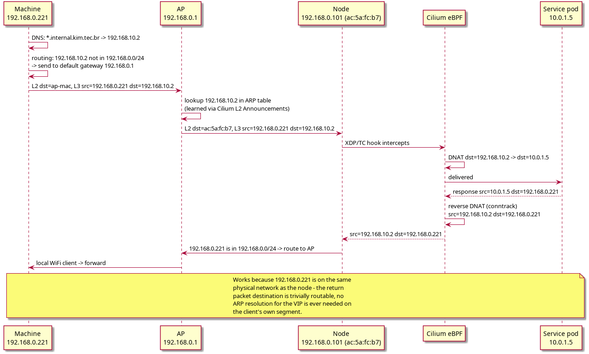

## What is Layer 2?

The OSI model splits networking into layers. **Layer 2 (Data Link)** handles communication between devices on the **same physical network segment** - no routing involved.

Key concepts:
* Devices identified by a **MAC address** (48-bit hardware address, e.g. `ac:5a:fc:b7:9e:f9`).
* Communication happens via **frames**, not packets.
* Scope is limited to devices directly reachable without a router.
* Examples: Ethernet, WiFi (802.11), VLANs.

**Layer 3 (Network)** is IP - routing between different networks. IP packets get wrapped in L2 frames to travel across a single hop.

The fundamental tension: **IP is L3, but hardware only understands L2 MAC addresses.** ARP bridges that gap.

#l2 #l3 #mac-address

## What is ARP?

**ARP = Address Resolution Protocol** (RFC 826, 1982). Purpose: translate an **IP address into a MAC address** so a frame can actually be delivered on L2.

When host A wants to send a packet to IP `192.168.0.5`, it needs the MAC of that IP to build the Ethernet/WiFi frame. ARP answers the question: *"who has this IP? tell me your MAC."*

#arp #rfc826

## How ARP works

### ARP cache

Every host keeps an **ARP cache** (a table of `IP -> MAC` mappings):
```
$ arp -n
Address         HWtype  HWaddress           Flags
192.168.0.1     ether   d8:0d:17:aa:bb:cc   C
192.168.0.102   ether   e4:5f:01:11:22:33   C
192.168.10.2    ether   (incomplete)         -
```
Entries expire (typically 60s to 20min). When an entry is missing, an ARP request fires to resolve it.

### ARP request / reply / gratuitous ARP



**Worked example - normal request/reply**: Host A (`192.168.0.101`, MAC `aa:aa:aa`) wants to reach `192.168.0.102`.
```
ARP REQUEST (broadcast, dst MAC ff:ff:ff:ff:ff:ff):
  sender IP:  192.168.0.101   sender MAC: aa:aa:aa
  target IP:  192.168.0.102   target MAC: 00:00:00:00:00:00 (unknown)

Every device on the segment receives this frame.
Only 192.168.0.102 replies.

ARP REPLY (unicast, dst MAC aa:aa:aa):
  sender IP:  192.168.0.102   sender MAC: bb:bb:bb
  target IP:  192.168.0.101   target MAC: aa:aa:aa
```
Host A caches `192.168.0.102 -> bb:bb:bb` and sends the actual packet.

**Worked example - gratuitous ARP**: a host announces its own `IP -> MAC` mapping **without being asked**. Used when a host comes online and claims an IP, when an IP moves to a new MAC, or on failover/migration - this is exactly the mechanism **MetalLB L2 mode** uses to announce VIPs:
```
ARP REQUEST broadcast, sender IP == target IP (the gratuitous signal):
  sender IP:  192.168.10.0   (the VIP)
  sender MAC: ac:5a:fc:b7    (the node's MAC)
  target IP:  192.168.10.0
```
Every device on the segment updates its cache: *"192.168.10.0 is now at ac:5a:fc:b7."*

#arp #arp-cache #gratuitous-arp #metallb

## ARP on Ethernet vs WiFi

This distinction is critical for Kubernetes clusters running on WiFi-connected nodes.



| Feature | Ethernet Switch | WiFi AP |
|---|---|---|
| Frame forwarding | Floods unknown MACs | Only to associated clients |
| ARP broadcast | Forwarded to all ports | Forwarded to associated clients |
| Gratuitous ARP | Accepted freely | **May be filtered** |
| IP ownership | Not tracked | Tracked per client MAC |

**Why**: an Ethernet switch is dumb at L2 - it just forwards frames based on a MAC table, with no concept of "which IP should this MAC be allowed to claim." A WiFi AP is a security-aware L2 bridge: when a node (`ac:5a:fc:b7`) associates, the AP registers *"MAC `ac:5a:fc:b7` owns IP `192.168.0.101`"* (usually from the DHCP lease). When that same MAC later sends gratuitous ARP claiming an *additional* IP (`192.168.10.2`, a MetalLB VIP), the AP sees a client claiming an IP outside its registered range and drops the frame. The rest of the network never updates its cache for `192.168.10.2`, the entry stays `(incomplete)`, and traffic never reaches the node.

Security features that cause this, implemented implicitly on consumer APs with no toggle to disable them:
* **ARP proxy** - AP answers ARP on behalf of clients, filtering unknown IPs.
* **Dynamic ARP Inspection (DAI)** - validates ARP against the DHCP lease table.
* **Client isolation** - some APs prevent direct client-to-client ARP entirely.

This is the reason MetalLB's plain L2 mode does not work reliably on this cluster's WiFi-connected nodes, and why Cilium's `CiliumL2AnnouncementPolicy` is used instead - Cilium answers the AP's ARP requests for the VIP directly rather than relying on the node blindly gratuitous-ARPing it onto the segment.

#arp #wifi #ethernet #metallb #cilium #l2-announcements

## Worked example: internal machine reaching a VIP successfully

Setup: machine `192.168.0.221` on the local WiFi network wants to reach VIP `192.168.10.2`, allocated by MetalLB and announced via **Cilium L2 Announcements** on node `192.168.0.101` (MAC `ac:5a:fc:b7`); the backing service pod is at `10.0.1.5`.



Forward path: the machine resolves DNS to the VIP, sees it is outside its own `/24`, and routes to the AP as default gateway. The AP already has `192.168.10.2 -> ac:5a:fc:b7` in its own ARP table, because Cilium answered that ARP request on the node's behalf - so the AP forwards the frame straight to the node. Cilium's eBPF hook intercepts at the XDP/TC layer and DNATs `192.168.10.2 -> 10.0.1.5`, delivering to the pod.

Return path: the pod's response gets its DNAT reversed by conntrack back to `192.168.10.2`, and since the destination (`192.168.0.221`) is on the node's own local subnet, no ARP resolution for the VIP is needed at all on the way back - it is a completely ordinary same-subnet delivery.

This case works cleanly specifically because the client sits on the same physical L2 segment as the node. See [[NAT - DNAT and SNAT]] for the DNAT/conntrack mechanics, and the [[Tailscale Mobile Cannot Reach LoadBalancer VIP]] troubleshoot note for what breaks when the client is instead a remote Tailscale peer with no direct L2 relationship to that segment.

#arp #cilium #l2-announcements #dnat #k8s
