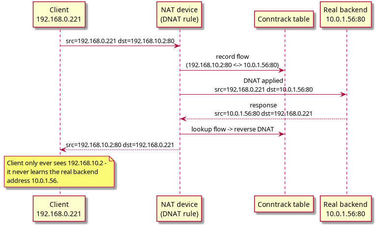
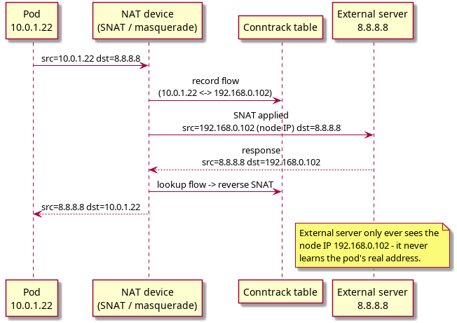
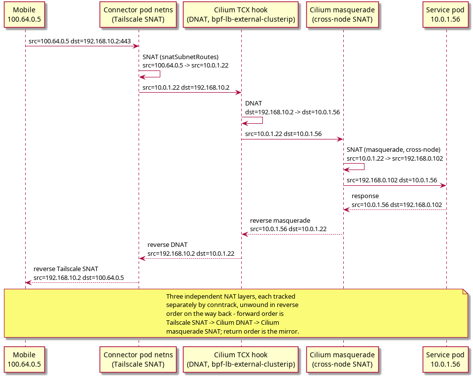

**NAT (Network Address Translation)** is rewriting IP addresses (and sometimes ports) in packet headers as they cross a network device. Two flavors, distinguished by which side of the packet gets rewritten:

* **DNAT** - rewrites the **Destination** address.
* **SNAT** - rewrites the **Source** address.

Both are **stateful**: a **conntrack** (connection tracking) table records every active flow, so the reverse translation on the return packet happens automatically without a matching rule having to exist for the reply direction.

#nat #conntrack

## DNAT - Destination NAT

**Purpose**: redirect traffic aimed at one `IP:port` to a different `IP:port`. The sender never learns the real backend address.



**Worked example**: a client wants to reach a service at `192.168.10.2:80`, but the real pod backing it lives at `10.0.1.56:80`.
```
Packet BEFORE DNAT:
  src=192.168.0.221   dst=192.168.10.2:80

DNAT rule: dst=192.168.10.2:80 -> dst=10.0.1.56:80

Packet AFTER DNAT:
  src=192.168.0.221   dst=10.0.1.56:80
```
On the way back, conntrack recognizes the reply belongs to that DNAT flow and reverses it before it reaches the client:
```
Response BEFORE reverse DNAT:
  src=10.0.1.56:80   dst=192.168.0.221

Response AFTER reverse DNAT:
  src=192.168.10.2:80   dst=192.168.0.221
```
The client receives a response that appears to come from `192.168.10.2` - exactly what it connected to - even though the packet was actually served by `10.0.1.56`.

**Common use cases**: load balancers (VIP -> real backend pod), router port forwarding (external port -> internal machine), Kubernetes Services (ClusterIP / LoadBalancer IP -> pod IP).

**In this cluster**, Cilium eBPF installs DNAT rules visible via `cilium service list`:
```
192.168.10.2:80  -> 10.0.1.56:80    (LoadBalancer VIP -> pod)
192.168.10.2:443 -> 10.0.1.56:443
192.168.10.0:80  -> 10.0.1.125:80
10.96.x.x:443    -> <apiserver>     (ClusterIP -> pod)
```

#dnat #load-balancer #k8s #cilium

## SNAT - Source NAT

**Purpose**: hide the real source IP by replacing it with a different one. The receiver sees a different origin than the actual sender.



**Worked example**: a pod at `10.0.1.22` sends traffic out to the public internet (`8.8.8.8`).
```
Packet BEFORE SNAT:
  src=10.0.1.22   dst=8.8.8.8

SNAT / masquerade rule: src=10.0.1.22 -> src=192.168.0.102 (node IP)

Packet AFTER SNAT:
  src=192.168.0.102   dst=8.8.8.8
```
Return path, again unwound automatically by conntrack:
```
Response:
  src=8.8.8.8   dst=192.168.0.102

Reverse SNAT:
  src=8.8.8.8   dst=10.0.1.22   -> delivered to the pod
```

**Common use cases**: home router masquerade (many private IPs -> one public IP), Kubernetes pod egress (pod CIDR -> node IP, so external servers have somewhere valid to reply to), a Tailscale subnet router SNATing overlay IPs to its own pod IP so the cluster has a route for return traffic (see [[Tailscale Internals]]).

**In this cluster**:
```
Cilium masquerade (enable-ipv4-masquerade: true), pod egress to external:
  src=10.0.1.22  ->  src=192.168.0.102 (node IP)

Tailscale SNAT (snatSubnetRoutes: true), mobile IP forwarded by connector pod:
  src=100.64.0.5  ->  src=10.0.1.22 (connector pod IP)
```
Without the Tailscale SNAT step, return traffic addressed to `100.64.0.5` would have no route on the node and would simply be dropped - the node has never heard of the `100.64.0.0/10` range on its own.

#snat #masquerade #k8s #cilium #tailscale

## DNAT + SNAT applied together

A real flow can pass through several independent NAT layers in sequence. Each layer is tracked separately by conntrack and unwound in reverse order on the return path - the last transformation applied forward is the first one reversed on the way back.

**Worked example: Mobile -> Tailscale -> LoadBalancer VIP -> Service pod**, combining everything above into one flow (mobile phone on the tailnet reaching an HTTPS service fronted by a Cilium LoadBalancer VIP):



```
FORWARD PATH

Mobile (100.64.0.5) sends to 192.168.10.2:443

Step 1 - Tailscale SNAT (inside connector pod netns):
  src=100.64.0.5   dst=192.168.10.2
       -> SNAT (snatSubnetRoutes)
  src=10.0.1.22    dst=192.168.10.2

Step 2 - Cilium DNAT (TCX from-endpoint hook, bpf-lb-external-clusterip: true):
  src=10.0.1.22    dst=192.168.10.2
                        -> DNAT
  src=10.0.1.22    dst=10.0.1.56

Step 3 - Cilium masquerade SNAT (cross-node forwarding):
  src=10.0.1.22    dst=10.0.1.56
       -> SNAT (masquerade)
  src=192.168.0.102   dst=10.0.1.56

Service pod receives:
  src=192.168.0.102   dst=10.0.1.56
```
```
RETURN PATH (all three reversed via conntrack, in reverse order)

Service pod responds:
  src=10.0.1.56   dst=192.168.0.102

Step 3 reversed - Cilium reverse masquerade:
  src=10.0.1.56   dst=10.0.1.22

Step 2 reversed - Cilium reverse DNAT:
  src=192.168.10.2   dst=10.0.1.22

Step 1 reversed - Tailscale reverse SNAT:
  src=192.168.10.2   dst=100.64.0.5

Tailscale re-encapsulates -> mobile receives the response.
```

This chaining is exactly why a single missing NAT layer (e.g. `bpf-lb-external-clusterip` unset - see [[Tailscale Internals]]) breaks the whole flow even though the other two layers are configured correctly: every layer in the chain must both apply forward and be reversible on return.

#nat #dnat #snat #conntrack #k8s #cilium #tailscale

## Key Difference Summary

| | DNAT | SNAT |
|---|---|---|
| Rewrites | **Destination** IP/port | **Source** IP/port |
| Direction | Inbound redirect | Outbound masquerade |
| Typical use | Load balancer, port forward | NAT gateway, egress masquerade |
| In this cluster | VIP -> pod IP | Pod IP -> node IP, Tailscale IP -> pod IP |
| Reversed by | Conntrack on return | Conntrack on return |
| Applied at | Cilium TCX hook (DNAT) | Cilium masquerade + Tailscale SNAT |
