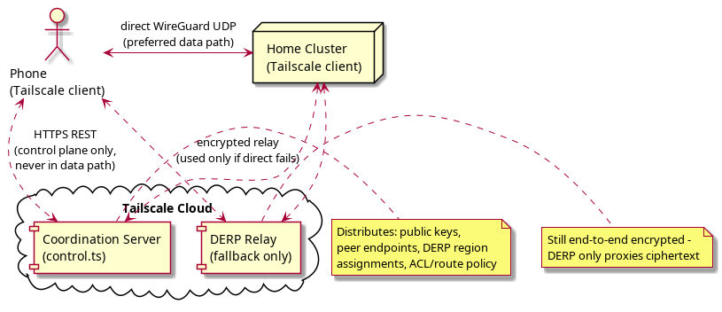
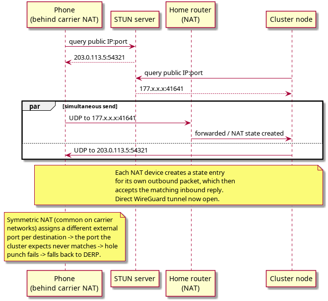
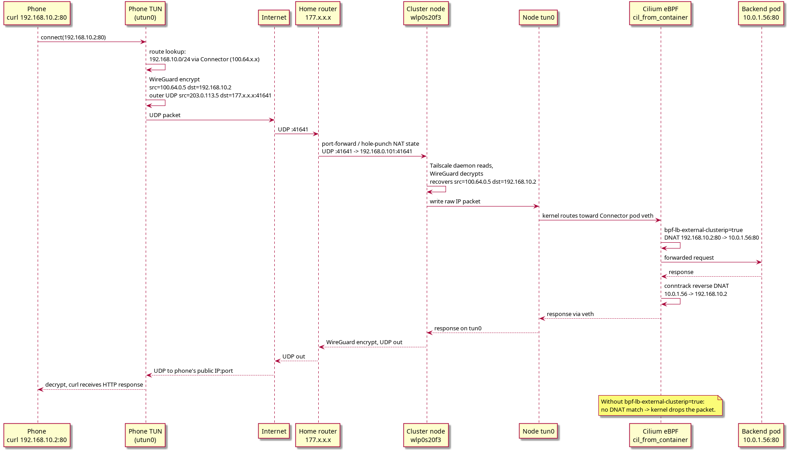

Tailscale is a mesh VPN built on WireGuard. Understanding how it actually moves packets end to end matters for reasoning about latency (direct vs relayed) and for debugging why traffic that reaches the node still fails to reach a workload behind it (e.g. a Kubernetes pod).

## Architecture Overview

Three components, each with a distinct job:

* **Coordination server** (`control.ts`) - control plane only, plain HTTPS REST. It is **never** in the data path.
* **DERP relay** - fallback data path, used only when a direct connection cannot be established.
* **WireGuard** - the actual encryption and data transport, always UDP.



#tailscale #architecture #wireguard #derp

## Phase 1 - Bootstrap (control plane)

At startup, every node contacts the coordination server:

1. The node authenticates and receives its identity: a **WireGuard public key** plus a **Tailscale IP** (`100.64.x.x`, from the shared `100.64.0.0/10` CGNAT range).
2. The coordination server distributes info about all peers: public keys, known endpoints (`IP:port`), and DERP region assignments.
3. If the node is a subnet router, it registers the routes it advertises (see the worked example below: `192.168.0.0/16` and `192.168.10.0/24`).
4. Peers that need those routes (e.g. a phone) receive them and know to route matching traffic via that subnet router.

After this handshake, the coordination server drops out of the path entirely - it only pushes state changes afterwards (new nodes, key rotation, policy updates). This is the key property that makes Tailscale scale: the control plane never needs to be fast, only the data plane does.

**Example**: a phone joins the tailnet and a Kubernetes "Connector" pod is already advertising `192.168.0.0/16` and `192.168.10.0/24`. The moment the phone authenticates, the coordination server tells it "route `192.168.x.x` through node `100.64.0.9`" - no manual static route needed on the phone.

#tailscale #control-plane #subnet-router

## Phase 2 - Connection Establishment (NAT traversal)

Two Tailscale nodes are almost never directly reachable - both usually sit behind NAT (carrier NAT for a phone, home router NAT for a server). Tailscale tries a direct UDP path first and only falls back to relaying if that fails.

### Hole punching

Both sides discover their own public `IP:port` via a STUN server, then send UDP simultaneously to each other's public address. Each NAT device creates a state entry for its own outbound packet, and that state entry is what lets the matching inbound reply through.



**Worked example**:
```
Phone public endpoint:   203.0.113.5:54321   (carrier NAT external side)
Cluster public endpoint: 177.x.x.x:41641     (home router external side)
```
Both sides fire UDP at the other's address at roughly the same time. If both NATs are "friendly" (cone NAT), the state entries line up and a direct WireGuard tunnel opens - no relay, minimum latency.

### When hole punching fails -> DERP

Some carrier NATs are **symmetric**: they assign a *different* external port for every distinct destination the phone talks to. The port the cluster learned about (via STUN, talking to the STUN server) is not the port the carrier NAT actually uses when the phone talks to the cluster - so the hole punch attempt never lines up.

When that happens, Tailscale falls back to **DERP** (Designated Encrypted Relay for Packets):

* Plain HTTPS proxying between the two peers.
* Still end-to-end encrypted - the DERP server only ever sees WireGuard ciphertext, it cannot read the traffic.
* Adds roughly 30-100ms round trip depending on the DERP region used.
* Nearest region to Brazil is `sao` (São Paulo).

#tailscale #nat-traversal #hole-punching #derp #symmetric-nat

## Phase 3 - Data Path (full packet journey)

Worked example: a phone runs `curl 192.168.10.2:80`, where `192.168.10.2` is a Kubernetes Service ClusterIP reachable only through a Tailscale Connector pod acting as subnet router.



Step by step:

1. **Phone - Tailscale app.** `curl` calls `connect(192.168.10.2:80)`. Tailscale intercepts via its TUN device (`utun0` on iOS/Android). A route lookup finds `192.168.10.0/24` is reachable via the Connector pod's node (`100.64.x.x`). WireGuard encrypts the packet: the inner packet keeps `src=100.64.0.5 dst=192.168.10.2`, the outer UDP datagram is `src=203.0.113.5 dst=177.x.x.x:41641`.
2. **Internet.** The UDP datagram traverses the carrier network onto the public internet.
3. **Home router (`177.x.x.x`).** Either a static port forward (`UDP 41641 -> 192.168.0.101:41641`) delivers it, or a hole-punch NAT state already created in Phase 2 does.
4. **Cluster node (`192.168.0.101`, interface `wlp0s20f3`).** The kernel receives the UDP datagram on port 41641. The Tailscale daemon reads it and WireGuard-decrypts it, recovering `src=100.64.0.5 dst=192.168.10.2`. It writes the resulting raw IP packet to `tun0`.
5. **Kernel routing on the node.** The packet now sits on `tun0` addressed to `192.168.10.2`. The kernel routes it toward the Connector pod, which means it crosses the pod's veth and hits the `cil_from_container` Cilium TCX hook.
6. **Cilium eBPF (`cil_from_container`).** Cilium sees `src=100.64.0.5 dst=192.168.10.2`. With `bpf-lb-external-clusterip=true`, it DNATs the ClusterIP to a real backend: `dst=192.168.10.2:80 -> dst=10.0.1.56:80`. **Without that flag, there is no DNAT match and the kernel silently drops the packet** - this is the single most common way this path breaks.
7. **Backend pod.** Receives the request, processes it, sends the response.
8. **Return path.** Conntrack reverses every NAT hop automatically: DNAT reversal (`10.0.1.56 -> 192.168.10.2`) back through the Connector pod veth to the node's `tun0`, where the Tailscale daemon reads it, WireGuard-encrypts it, and sends it back out as UDP to the phone's public `IP:port`. The phone decrypts and `curl` finally sees the HTTP response.

#tailscale #cilium #ebpf #dnat #packet-journey #k8s

## TUN Device

Tailscale uses a **TUN** (tunnel) interface - a Layer 3 only virtual NIC. No MAC address, no ARP.

```
Normal NIC:  kernel <-> hardware driver <-> physical wire
TUN device:  kernel <-> /dev/net/tun <-> userspace daemon (Tailscale)
```

The daemon talks to the kernel with plain `read()`/`write()` syscalls on `/dev/net/tun`:

* **Sending**: daemon calls `write(fd, raw_ip_packet)` -> the kernel sees a packet "arrive" on `tun0`.
* **Receiving**: daemon calls `read(fd)` -> gets the next raw IP packet the kernel wants sent out.

**Critical consequence**: when Tailscale writes a packet to `tun0`, it is already a fully formed IP packet - there is no `connect()` syscall involved at that point, so Cilium's socket-level BPF hooks have nothing to intercept. The packet goes straight to the TCX hook (`cil_from_container`) instead.

**Worked example of why this matters**: a `curl` issued *from inside* the Tailscale pod's own network namespace works, because that `connect()` call is visible to Cilium's socket BPF. The same traffic *forwarded through* the pod via the TUN device does not get the same treatment - it bypasses socket BPF entirely and only becomes visible at the TCX hook, which is why `bpf-lb-external-clusterip=true` is required for that specific path.

### TUN vs TAP

| | TUN | TAP |
|---|---|---|
| Layer | L3 (IP packets) | L2 (Ethernet frames) |
| MAC address | No | Yes |
| ARP | No | Yes |
| Used by | Tailscale, WireGuard, OpenVPN | VM networking, bridges |

#tailscale #tun #tap #cilium #ebpf

## Subnet Router and SNAT (`snatSubnetRoutes`)

A Tailscale "Connector" pod can act as a subnet router, advertising LAN ranges (e.g. `192.168.0.0/16` and `192.168.10.0/24`) to every peer on the tailnet, so that Tailscale clients can reach plain LAN devices/Services without installing Tailscale on them.

With `snatSubnetRoutes: true`, traffic forwarded through the subnet router is SNATed to the pod's own IP before it reaches the backend. Consequences:

* Return traffic naturally comes back to the pod (correct, since the pod's IP is what the backend saw as the source).
* The backend pod sees the source IP as the Connector pod's IP, **not** the original phone's Tailscale IP - the original client identity is lost at that hop.

**Why this trade-off exists**: without SNAT, the backend would try to reply directly to `100.64.x.x`, which is only routable back out through the subnet router in the first place. The backend pod would have to know to route replies through the connector - which it normally does not - so the reply would simply fail. SNATing to the pod's own IP sidesteps that by making the connector itself the "client" from the backend's point of view.

#tailscale #snat #subnet-router #connector

## Relevant Cluster Config Reference

| Setting | Value | Effect |
|---|---|---|
| `snatSubnetRoutes` | `true` | Connector pod SNATs forwarded traffic to its own pod IP |
| `bpf-lb-external-clusterip` | `true` | Cilium DNATs ClusterIP/LB IPs for pod-forwarded (TUN) traffic |
| Connector pod | regular pod, **not** `hostNetwork` | Traffic enters via the pod's veth, not the node's NIC |

#tailscale #cilium #k8s #config
