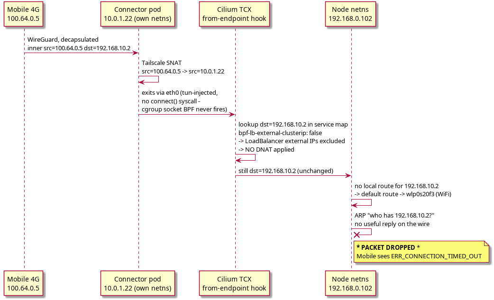

## Symptom

A mobile device on 4G, connected via Tailscale (`100.64.0.5`), tries to reach a Kubernetes LoadBalancer VIP (`192.168.10.2`, backed by service pod `10.0.1.56`) that is advertised through a Tailscale subnet router Connector pod (`10.0.1.22`, running as a regular pod, not `hostNetwork`, on node `192.168.0.102`). The request hangs and eventually fails with `ERR_CONNECTION_TIMED_OUT`.

Critically, the VIP is confirmed reachable from a normal LAN client, and `arping 192.168.10.2` succeeds from the LAN - Cilium's `CiliumL2AnnouncementPolicy` is answering ARP for the VIP correctly (see [[ARP - Address Resolution Protocol]]). So this is **not** the WiFi/AP ARP-filtering problem covered there. Something else, specific to traffic that enters the node from *inside* a pod rather than off the wire, is dropping the packet.

#tailscale #k8s #cilium #timeout

## Investigation

Tracing the forward path step by step from inside the connector pod's network namespace:

1. Tailscale decapsulates the WireGuard tunnel, recovering the inner packet `src=100.64.0.5 dst=192.168.10.2`.
2. Tailscale's own SNAT (`snatSubnetRoutes: true`) rewrites it to `src=10.0.1.22 dst=192.168.10.2` (see [[NAT - DNAT and SNAT]]).
3. The packet is injected onto `tun0` and exits the pod via `eth0`, hitting Cilium's TCX `from-endpoint` hook.
4. At the TCX hook, Cilium looks up `dst=192.168.10.2` in its service map. The LoadBalancer entries exist (`192.168.10.2:80 -> 10.0.1.56:80`, `192.168.10.2:443 -> 10.0.1.56:443`), but with `bpf-lb-external-clusterip: false` (the default), **LoadBalancer external IPs are excluded from DNAT for pod-originated traffic**. No DNAT is applied - the packet leaves the hook still addressed to `192.168.10.2`.
5. It reaches the node's own network namespace still destined for `192.168.10.2`, which has no local route on the node, so it falls through to the default route out the WiFi interface (`wlp0s20f3`).
6. The node ARPs on the wire for `192.168.10.2` - but the node itself doesn't answer its own ARP for a VIP it's supposed to be the backend for, so there's no useful reply, and the packet is dropped.

**Why `curl` from inside the pod works but Tailscale-forwarded traffic does not**, even though both originate from the same pod:
```
curl http://192.168.10.2:80
  -> connect() syscall -> Cilium's cgroup socket BPF intercepts it
     Rewrites the destination BEFORE the packet is even built:
     connect() completes directly to 10.0.1.56
     Packet exits the pod already addressed to 10.0.1.56 - the TCX hook
     never even sees 192.168.10.2.

Tailscale tun-forwarded packet: src=10.0.1.22 dst=192.168.10.2
  -> no connect() syscall is ever made (the tun device injects an
     already-formed IP packet straight into the kernel) - cgroup
     socket BPF never runs for it.
     Packet exits the pod with dst=192.168.10.2 still unresolved ->
     hits the TCX hook -> no DNAT applies -> dropped.
```
This is the same TUN-device property described in [[Tailscale Internals]]: a fully-formed IP packet written to a TUN device has no syscall for socket-level BPF to intercept, so only hook-level (TCX) DNAT rules can act on it - and those rules were configured to skip exactly this case.



#tailscale #cilium #ebpf #tcx #cgroup-bpf #tun

## Root cause

`bpf-lb-external-clusterip` was `false` (the Cilium default). This flag controls whether Cilium's TCX `from-endpoint` hook includes **LoadBalancer/external IPs** (not just ClusterIPs) in the DNAT rules it applies to pod-originated traffic. With it disabled, only ClusterIPs get DNAT'd from inside a pod - LoadBalancer VIPs pass through untouched, leaving them to be resolved by ordinary L3/L2 routing on the node, which fails because the node has no reason to own or ARP for that VIP on the wire.

## Fix

Enable the flag cluster-wide and roll the Cilium DaemonSet to pick it up:
```bash
kubectl patch configmap -n kube-system cilium-config \
  --type merge \
  -p '{"data":{"bpf-lb-external-clusterip":"true"}}'
kubectl rollout restart ds/cilium -n kube-system
```
After the fix, the same TCX hook step in the trace above becomes:
```
4. Cilium TCX from-endpoint hook (after fix):
   Looks up dst=192.168.10.2 -> DNAT -> dst=10.0.1.56
   Packet: src=10.0.1.22 dst=10.0.1.56
   -> delivered to service pod -> response returns via Tailscale -> mobile
```

**Important distinction to keep in mind**: this fix is completely independent of the L2 announcement mechanism covered in [[ARP - Address Resolution Protocol]]. That mechanism (MetalLB vs Cilium `CiliumL2AnnouncementPolicy`) governs whether **external clients on the physical network** can resolve ARP for the VIP at all. `bpf-lb-external-clusterip` governs whether **pods inside the cluster** (including tun-forwarded traffic like Tailscale's) get DNAT'd toward the VIP's real backend. A cluster can have one working and the other broken - both were required here for the mobile-via-Tailscale path to function end to end.

#tailscale #cilium #bpf-lb-external-clusterip #fix #k8s
